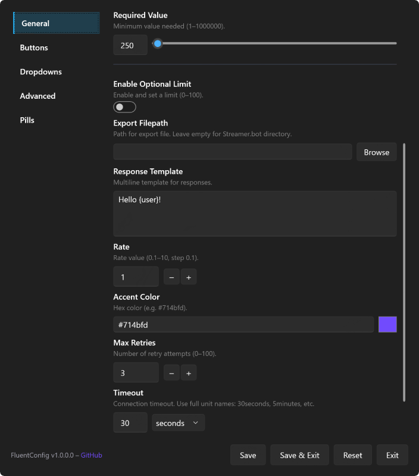

# FluentConfig

A library for building plugin settings UIs inside Streamer.bot. Tabbed panels, toggles, sliders, dropdowns, and more — defined with a fluent C# API and rendered in WebView2 (Svelte UI).

## Why FluentConfig?



Configuring a Streamer.bot plugin shouldn't require editing code. Chains of "Set Argument" subactions are tedious and error-prone. Asking end users to open raw C# is unrealistic for most of them. FluentConfig bridges that gap: end users get an easy-to-use GUI, and you define it with a simple, readable API. Here's what that looks like in practice:

```csharp
FluentConfigUi.Create(CPH, "My Extension", "1.0")
    .Section("General", "general", s => s
        .Toggle("Enable feature", "enabled")
        .Textbox("Username", "username")
        .Slider("Volume", "volume").Range(0, 100).Default(50))
    .Show();
```

Each method call adds a control. Options chain onto it. That's the whole model. Settings persist automatically as JSON in Streamer.bot globals (`FluentConfig_Settings_{title}`).

**Reading values at runtime** depends on context:

| Context | API |
|---------|-----|
| After the user opens/saves the UI | `CPH.GetGlobalVar<string>("FluentConfig_Settings_{title}", true)` then parse JSON |
| Button `OnClick` handlers | `UiContext.Pending<T>(saveKey)` |
| Pill `OnAdded` / `OnRemoved` | `CallbackContext.GetValue<T>(saveKey)` |

## Quick Start

The fastest path is to import an example from [examples/](examples/). It comes preconfigured with everything that's easy to get wrong:

**Execute C# Method subaction with `Run on UI thread` enabled.** This is the most important part, and it requires a specific two-subaction setup. Your plugin logic lives inside a disabled **Execute C# Code** subaction so it doesn't auto-run when a trigger fires. Then a separate **Execute C# Method** subaction calls the main function from that file, with **Run on UI thread** turned on. That toggle only exists on Execute C# Method, not on Execute C# Code, which is why both subactions are needed. Without `Run on UI thread`, the host window won't display correctly or will throw errors.

**GAC-based assembly references.** These work across .NET 4.7.2, 4.8, and 4.8.1. References tied to a specific version folder (e.g. `v4.8`) break on machines that only have 4.8.1 installed.

**DLL and version check.** Verifies FluentConfig.dll is present before opening, and prevents duplicate windows from stacking.

### Manual setup

1. Copy `FluentConfig.dll` (and `Newtonsoft.Json.dll` if needed) into your Streamer.bot `dlls/` folder. Do **not** copy WebView2 DLLs — Streamer.bot already loads them.
2. Create an **Execute C# Code** subaction with your plugin code and **disable** it so it doesn't run on trigger.
3. Create an **Execute C# Method** subaction, point it at the code file from step 2, select your main method, and enable **Run on UI thread**.
4. Add assembly references as documented in [docs/REFERENCES.md](docs/REFERENCES.md). Use GAC paths, not version-specific Reference Assembly folders.
5. Write your UI using the fluent API shown above.

## Building

The solution is `SB-FluentConfig.slnx` (net481). The shipping assembly is `FluentConfig/Host` with `AssemblyName=FluentConfig`.

```powershell
# Debug (WebView2 loads http://localhost:5173 — run `bun run dev` in FluentConfig/web)
dotnet build FluentConfig/Host/Host.csproj -c Debug

# Release (embeds the Vite single-file bundle; requires Bun + bun install in FluentConfig/web)
dotnet build FluentConfig/Host/Host.csproj -c Release
```

Outputs land in `FluentConfig/Host/bin/{Debug|Release}/net481/FluentConfig.dll`. Or use [FluentConfig/scripts/Redeploy.ps1](FluentConfig/scripts/Redeploy.ps1) to rebuild and copy into a local Streamer.bot `dlls/` folder.

## Layout

| Path | Role |
|------|------|
| [FluentConfig/Host/](FluentConfig/Host/) | C# host → `FluentConfig.dll` (WPF shell + WebView2 + DSL) |
| [FluentConfig/web/](FluentConfig/web/) | Svelte 5 settings UI |
| [FluentConfig/PROTOCOL.md](FluentConfig/PROTOCOL.md) | Host ↔ web wire contract |
| [FluentConfig/UpdaterHelper/](FluentConfig/UpdaterHelper/) | Optional stage-and-swap helper exe |
| [docs/](docs/) | Plugin author docs |
| [examples/](examples/) | Copy-paste Streamer.bot actions |
| [decompile/](decompile/) | Local reference dumps (gitignored) |

## Documentation

See the index at [docs/README.md](docs/README.md). Highlights:

| Document | Contents |
|----------|----------|
| [docs/PLUGIN_DEVELOPER_GUIDE.md](docs/PLUGIN_DEVELOPER_GUIDE.md) | Integration guide: Create, Section, Show, pills, updater |
| [docs/EXTENSION_UPDATES.md](docs/EXTENSION_UPDATES.md) | Self-update vs notify-only extension update paths |
| [docs/REFERENCES.md](docs/REFERENCES.md) | Assembly reference setup for Streamer.bot C# actions |
| [docs/performance/README.md](docs/performance/README.md) | Cold/warm open baselines and how to remeasure |
| [FluentConfig/PROTOCOL.md](FluentConfig/PROTOCOL.md) | Host ↔ web message contract |
| [FluentConfig/Host/PACKAGING.md](FluentConfig/Host/PACKAGING.md) | Deploy footprint (FluentConfig.dll + Newtonsoft; WebView2 from Streamer.bot) |
| [FluentConfig/ARCHITECTURE.md](FluentConfig/ARCHITECTURE.md) | Module boundaries and design notes |
| [FluentConfig/README.md](FluentConfig/README.md) | Host/web package overview |
| [examples/README.md](examples/README.md) | Example action index |

## Examples

See [examples/README.md](examples/README.md) for the full index. Highlights:

| Example | What it shows |
|---------|--------------|
| `menu/SimpleExample.cs` | Minimal setup: toggle, textbox, slider |
| `menu/MediumExample.cs` | Dropdown, slider, button, `ShowWhen` visibility |
| `menu/MediumValuesExample.cs` | Read saved Medium settings from a runtime action |
| `menu/DevPreviewExample.cs` | Mirrors the localhost mock document for in-SB comparison |
| `menu/CompleteExample.cs` | Broad control surface (including Pill / schema nesting) |
| `updater/DllCheckExample.cs` | Install + daily FluentConfig.dll check (no FluentConfig ref) |
| `updater/ExtensionUpdateExample.cs` | In-menu extension update modal (`WithExtensionUpdateNotice`) |
